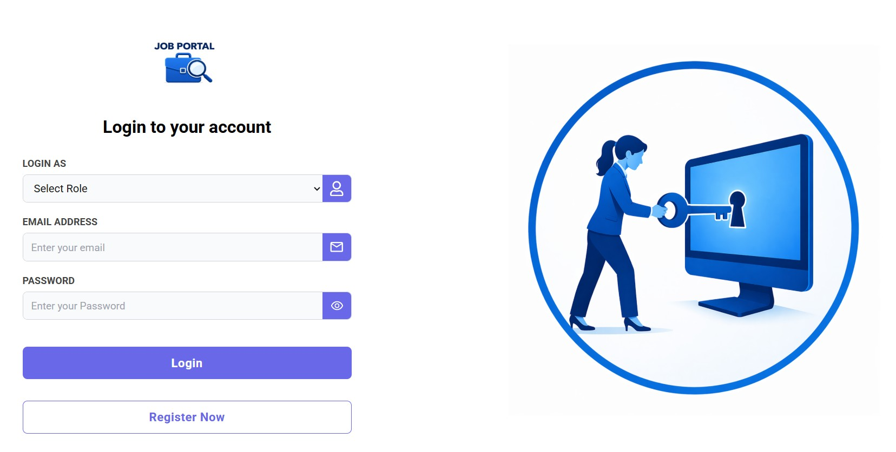
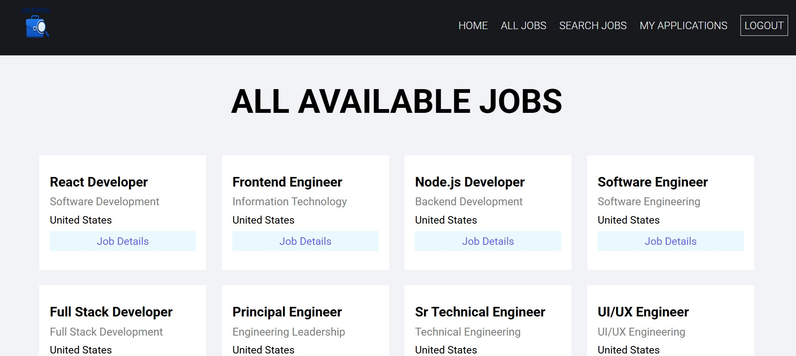
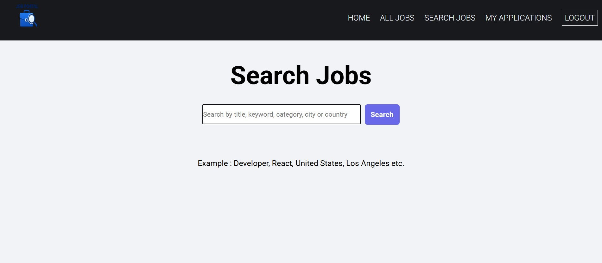
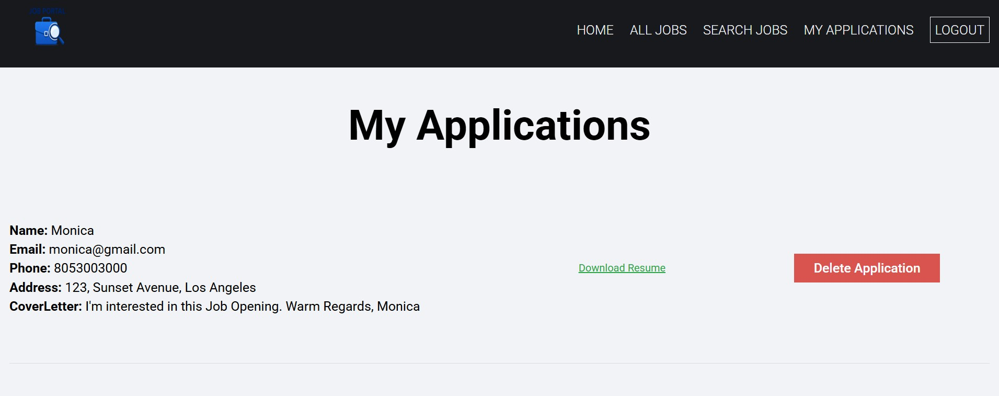

# 🚀 MERN Full-Stack Job Portal with JWT Authentication

> **A production-ready full-stack Job Portal built with the MERN Stack, featuring secure authentication, role-based access, job posting, application tracking, resume uploads, and a responsive modern UI.**

---

## 🌐 Live Demo

### 👉 **Click here to view the live deployed project**

**Frontend (Vercel) + Backend (Render)**

🔗 **https://react-job-portal-delta.vercel.app/**

---

## 📸 Project Preview

Login Page for Job Seekers/ Employers


Display all jobs available


Search Jobs using keywords


View Applied Jobs (Can download resume, delete application)


---

## ✨ Features

### 👨‍💼 Job Seeker

- Secure Registration & Login
- JWT Authentication
- Browse available jobs
- Search job listings
- Apply for jobs
- Upload Resume
- View Applied Jobs
- Manage Profile

### 🏢 Employer

- Secure Registration & Login
- Post New Jobs
- Edit/Delete Posted Jobs
- View Applicants
- Manage Job Listings

### 🔐 Security

- JWT Authentication
- Password Hashing using Bcrypt
- Protected Routes
- Secure Cookie Authentication

### 📱 Responsive UI

- Fully responsive design
- Mobile, Tablet & Desktop compatible
- Clean and modern interface

---

## 🛠 Tech Stack

### Frontend

- React.js
- React Router
- Bootstrap
- Axios

### Backend

- Node.js
- Express.js
- MongoDB Atlas
- Mongoose

### Authentication

- JWT (JSON Web Tokens)
- Bcrypt

### Cloud Services

- Cloudinary (Resume/Image Upload)

### Deployment

- **Frontend:** Vercel
- **Backend:** Render
- **Database:** MongoDB Atlas

---

## 📂 Project Structure

```
react-job-portal/
│
├── frontend/
│ ├── src/
│ ├── public/
│ └── package.json
│
├── backend/
│ ├── controllers/
│ ├── models/
│ ├── routes/
│ ├── middleware/
│ ├── config/
│ └── server.js
│
└── README.md
```

---

## 🚀 Getting Started

### Prerequisites

- Node.js v22.2.0 or above
- MongoDB Atlas Account (or Local MongoDB)
- Cloudinary Account

---

### Installation

Clone the repository

```bash
git clone https://github.com/Monica-Web88/react-job-portal.git
```

Install Backend Dependencies

```bash
cd react-job-portal/backend
npm install
```

Install Frontend Dependencies

```bash
cd ../frontend
npm install
```

---

## ⚙️ Environment Variables

> **If you don't want to change the existing `.env` credentials, skip this section.**

Create a `config.env` file inside:

```
backend/config/
```

Add the following:

```env
PORT=
CLOUDINARY_API_KEY=
CLOUDINARY_API_SECRET=
CLOUDINARY_CLOUD_NAME=
FRONTEND_URL=
DB_URL=
JWT_SECRET_KEY=
JWT_EXPIRE=
COOKIE_EXPIRE=
```

Replace each value with your own configuration.

---

## ▶️ Run the Project

### Backend

```bash
cd backend
node server.js
```

### Frontend

```bash
cd frontend
npm run dev
```

Open your browser:

```
http://localhost:5173
```

---

## ⭐ Highlights

- Full MERN Stack Application
- JWT Authentication
- Role-Based Access Control
- Resume Upload with Cloudinary
- Secure Password Encryption
- RESTful API Architecture
- MongoDB Atlas Integration
- Responsive Bootstrap UI
- Production Deployment on Vercel & Render

---

## 📬 Contact

**Monica Arunkumar**

GitHub: https://github.com/Monica-Web88
